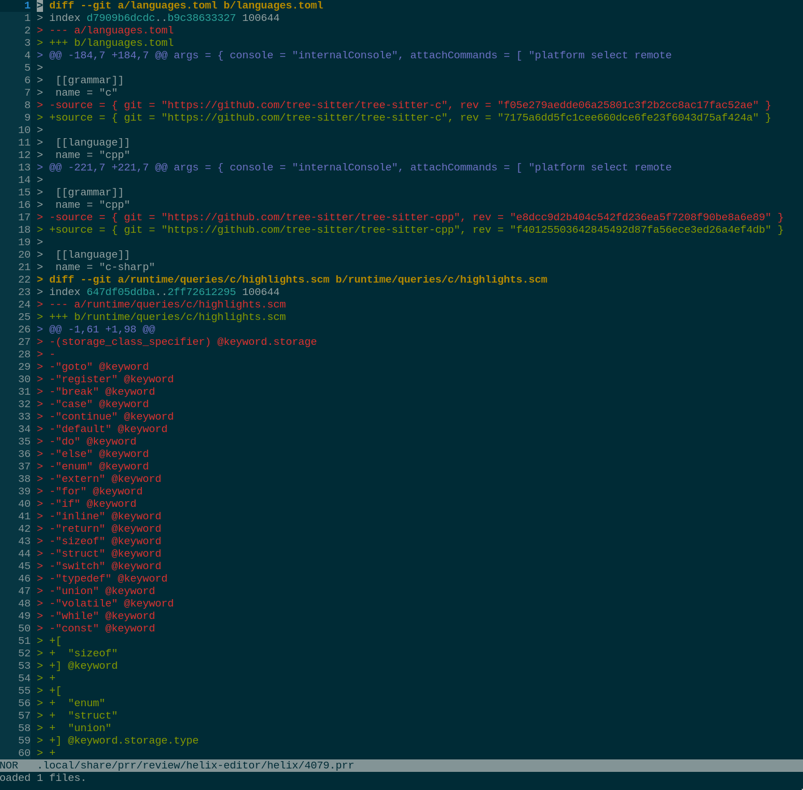

# `tree-sitter-diff` (but really `tree-sitter-prr`)

[![CI][ci-badge]][ci-workflow]

This is a fork of [the-mikedavis/tree-sitter-diff](https://github.com/the-
mikedavis/tree-sitter-diff) that basically just adds a `>` in front of every
line.

I did this because I wanted to try out the
[mailing-list-style-code-review-tool-for-GitHub, `prr`](https://github.com/danobi/prr),
but wanted to have syntax highlighting in
[Helix](https://github.com/helix-editor/helix)

## Usage in Helix

Update your `languages.toml` with the following:

```toml
[[language]]
name = "prr"
scope = "source.prr"
roots = []
file-types = ["prr"]
injection-regex = "prr"

[[grammar]]
name = "prr"
source = { git = "https://github.com/bcspragu/tree-sitter-diff", rev = "3390ef2dce6c749900a9dca72671b06c83d2bc59" }
```

And then run `hx --grammar fetch && hx --grammar build`. I had to do a bunch of
manual `chown`-ing because the
[Arch AUR helix-git package](https://aur.archlinux.org/packages/helix-git) puts
everything in `/usr/lib/helix`, which is owned by `root`.

## Example

I swear it works, here's a diff of
[a random Helix PR](https://github.com/helix-editor/helix/pull/4079) I loaded
with `prr get helix-editor/helix/4079`:



[ci-badge]: https://github.com/bcspragu/tree-sitter-diff/actions/workflows/ci.yml/badge.svg
[ci-workflow]: https://github.com/bcspragu/tree-sitter-diff/actions/workflows/ci.yml
[tree-sitter]: https://tree-sitter.github.io/tree-sitter/
[tree-sitter-diff (actual)]: https://github.com/the-mikedavis/tree-sitter-diff
[tree-sitter-git-commit]: https://github.com/the-mikedavis/tree-sitter-git-commit
